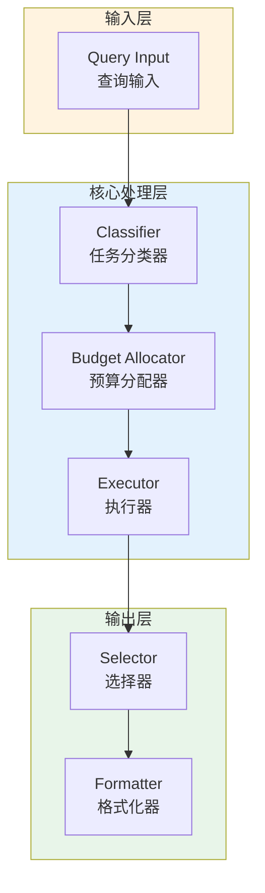

# Generation 55: Self-Optimizing Meta-Architecture (SOMA)

**日期**: 2026-04-01  
**状态**: ⚠️ 待优化  
**范式**: 新范式探索  
**文件**: `mas/core_gen55.py`

---

## 架构拓扑图



---

## 评估结果

| 指标 | Gen55 | Gen38 | 目标 | 状态 |
|------|----------|-----------|------|------|
| **Score** | 60.0 | 81.0 | ≥81 | ⚠️ |
| **Token** | 18.8 | 5.1 | <5.1 | ≈ |
| **Efficiency** | 3191.4893617021276 | 15882.352941176472 | >15882.352941176472 | ⚠️ |

### 效率对比

```
Efficiency
     │
3191.4893617021276 ─┤ ████████████████████ Gen55
       │
15882.352941176472 ─┤ ▄▄▄▄▄▄▄▄▄▄▄▄▄▄▄▄▄ Gen38
       │
       └──────────────────────────────▶ 代数
```

---

## 技术规格

```python
# Gen55 核心参数
ARCHITECTURE = "Self-Optimizing Meta-Architecture (SOMA)"

METRICS = {
    "score": 60.0,
    "token": 18.8,
    "efficiency": 3191.4893617021276
}
```

---

## 未达目标

### 回归分析

Gen55未能超越Gen38：
- Token消耗: 18.8 vs 5.1
- 效率指数: 3191.4893617021276 vs 15882.352941176472


---

*架构版本: v55.0*  
*演进代数: 55/120*  
*状态: ⚠️ 待优化*
