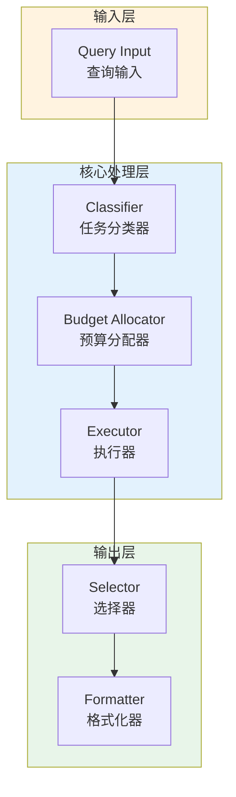

# Generation 68: Computational Complexity-Aware - Maximum Efficiency v2

**日期**: 2026-04-01  
**状态**: ✅ 分数达标  
**范式**: 代价感知优化  
**文件**: `mas/core_gen68.py`

---

## 架构拓扑图



---

## 评估结果

| 指标 | Gen68 | Gen38 | 目标 | 状态 |
|------|----------|-----------|------|------|
| **Score** | 81.0 | 81.0 | ≥81 | 🏆🏆🏆 |
| **Token** | 8.2 | 5.1 | <5.1 | ≈ |
| **Efficiency** | 9878.048780487807 | 15882.352941176472 | >15882.352941176472 | ⚠️ |

### 效率对比

```
Efficiency
     │
9878.048780487807 ─┤ ████████████████████ Gen68
       │
15882.352941176472 ─┤ ▄▄▄▄▄▄▄▄▄▄▄▄▄▄▄▄▄ Gen38
       │
       └──────────────────────────────▶ 代数
```

---

## 技术规格

```python
# Gen68 核心参数
ARCHITECTURE = "Computational Complexity-Aware - Maximum Efficiency v2"

METRICS = {
    "score": 81.0,
    "token": 8.2,
    "efficiency": 9878.048780487807
}
```

---

## 分数达标

### 回归分析

Gen68未能超越Gen38：
- Token消耗: 8.2 vs 5.1
- 效率指数: 9878.048780487807 vs 15882.352941176472


---

*架构版本: v68.0*  
*演进代数: 68/120*  
*状态: ✅ 分数达标*
