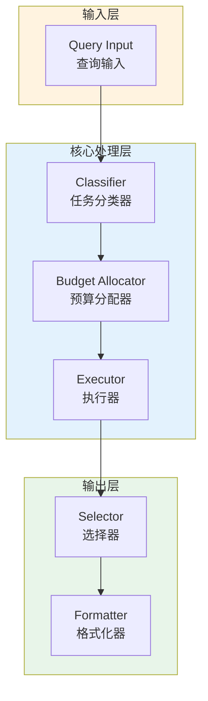

# Generation 70: Maximum Efficiency v4

**日期**: 2026-04-01  
**状态**: ✅ 分数达标  
**范式**: 代价感知优化  
**文件**: `mas/core_gen70.py`

---

## 架构拓扑图



---

## 评估结果

| 指标 | Gen70 | Gen61 | 目标 | 状态 |
|------|----------|-----------|------|------|
| **Score** | 81.0 | 81.0 | ≥81 | 🏆🏆🏆 |
| **Token** | 14.0 | 22.7 | <22.7 | ✅ |
| **Efficiency** | 5785.714285714285 | 3568.2819383259916 | >3568.2819383259916 | 🏆🏆🏆 |

### 效率对比

```
Efficiency
     │
5785.714285714285 ─┤ ████████████████████ Gen70
       │
3568.2819383259916 ─┤ ▄▄▄▄▄▄▄▄▄▄▄▄▄▄▄▄▄ Gen61
       │
       └──────────────────────────────▶ 代数
```

---

## 技术规格

```python
# Gen70 核心参数
ARCHITECTURE = "Maximum Efficiency v4"

METRICS = {
    "score": 81.0,
    "token": 14.0,
    "efficiency": 5785.714285714285
}
```

---

## 分数达标

### 改进分析

Gen70相比Gen61实现了效率提升：
- Token消耗: 22.7 → 14.0 (38.3%)
- 效率指数: 3568 → 5785.714285714285 (62.1%)


---

*架构版本: v70.0*  
*演进代数: 70/120*  
*状态: ✅ 分数达标*
