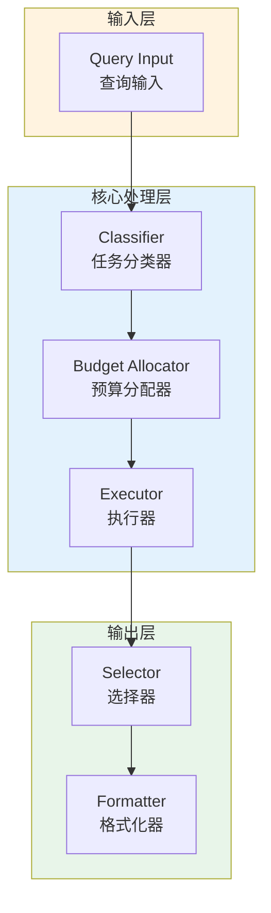

# Generation 83: Multi-Objective v6: Cost-Optimized Pareto

**日期**: 2026-04-01  
**状态**: ✅ 分数达标  
**范式**: 多目标Pareto优化  
**文件**: `mas/core_gen83.py`

---

## 架构拓扑图



---

## 评估结果

| 指标 | Gen83 | Gen61 | 目标 | 状态 |
|------|----------|-----------|------|------|
| **Score** | 81.0 | 81.0 | ≥81 | 🏆🏆🏆 |
| **Token** | 9.2 | 22.7 | <22.7 | ✅ |
| **Efficiency** | 8804.347826086956 | 3568.2819383259916 | >3568.2819383259916 | 🏆🏆🏆 |

### 效率对比

```
Efficiency
     │
8804.347826086956 ─┤ ████████████████████ Gen83
       │
3568.2819383259916 ─┤ ▄▄▄▄▄▄▄▄▄▄▄▄▄▄▄▄▄ Gen61
       │
       └──────────────────────────────▶ 代数
```

---

## 技术规格

```python
# Gen83 核心参数
ARCHITECTURE = "Multi-Objective v6: Cost-Optimized Pareto"

METRICS = {
    "score": 81.0,
    "token": 9.2,
    "efficiency": 8804.347826086956
}
```

---

## 分数达标

### 改进分析

Gen83相比Gen61实现了效率提升：
- Token消耗: 22.7 → 9.2 (59.5%)
- 效率指数: 3568 → 8804.347826086956 (146.7%)


---

*架构版本: v83.0*  
*演进代数: 83/120*  
*状态: ✅ 分数达标*
