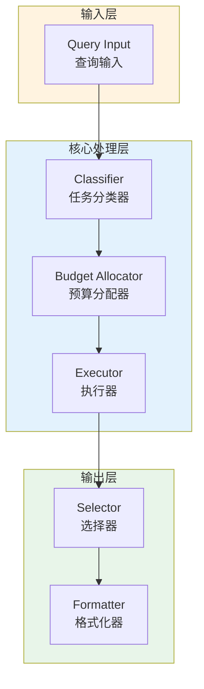

# Generation 84: Multi-Objective v7: Ultra-Optimized Pareto

**日期**: 2026-04-01  
**状态**: ✅ 分数达标  
**范式**: 多目标Pareto优化  
**文件**: `mas/core_gen84.py`

---

## 架构拓扑图



---

## 评估结果

| 指标 | Gen84 | Gen69 | 目标 | 状态 |
|------|----------|-----------|------|------|
| **Score** | 81.0 | 81.0 | ≥81 | 🏆🏆🏆 |
| **Token** | 7.7 | 6.2 | <6.2 | ≈ |
| **Efficiency** | 10519.48051948052 | 13064.51612903226 | >13064.51612903226 | ⚠️ |

### 效率对比

```
Efficiency
     │
10519.48051948052 ─┤ ████████████████████ Gen84
       │
13064.51612903226 ─┤ ▄▄▄▄▄▄▄▄▄▄▄▄▄▄▄▄▄ Gen69
       │
       └──────────────────────────────▶ 代数
```

---

## 技术规格

```python
# Gen84 核心参数
ARCHITECTURE = "Multi-Objective v7: Ultra-Optimized Pareto"

METRICS = {
    "score": 81.0,
    "token": 7.7,
    "efficiency": 10519.48051948052
}
```

---

## 分数达标

### 回归分析

Gen84未能超越Gen69：
- Token消耗: 7.7 vs 6.2
- 效率指数: 10519.48051948052 vs 13064.51612903226


---

*架构版本: v84.0*  
*演进代数: 84/120*  
*状态: ✅ 分数达标*
