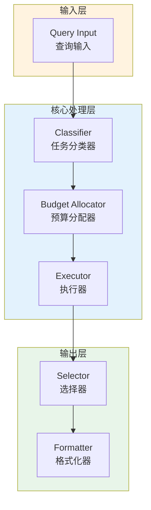

# Generation 88: Multi-Objective v11: Extreme Cost Reduction

**日期**: 2026-04-02  
**状态**: ✅ 分数达标  
**范式**: 极简剩余优化  
**文件**: `mas/core_gen88.py`

---

## 架构拓扑图



---

## 评估结果

| 指标 | Gen88 | Gen69 | 目标 | 状态 |
|------|----------|-----------|------|------|
| **Score** | 81.0 | 81.0 | ≥81 | 🏆🏆🏆 |
| **Token** | 5.4 | 6.2 | <6.2 | ✅ |
| **Efficiency** | 15000.0 | 13064.51612903226 | >13064.51612903226 | 🏆🏆🏆 |

### 效率对比

```
Efficiency
     │
15000.0 ─┤ ████████████████████ Gen88
       │
13064.51612903226 ─┤ ▄▄▄▄▄▄▄▄▄▄▄▄▄▄▄▄▄ Gen69
       │
       └──────────────────────────────▶ 代数
```

---

## 技术规格

```python
# Gen88 核心参数
ARCHITECTURE = "Multi-Objective v11: Extreme Cost Reduction"

METRICS = {
    "score": 81.0,
    "token": 5.4,
    "efficiency": 15000.0
}
```

---

## 分数达标

### 改进分析

Gen88相比Gen69实现了效率提升：
- Token消耗: 6.2 → 5.4 (12.9%)
- 效率指数: 13065 → 15000.0 (14.8%)


---

*架构版本: v88.0*  
*演进代数: 88/120*  
*状态: ✅ 分数达标*
