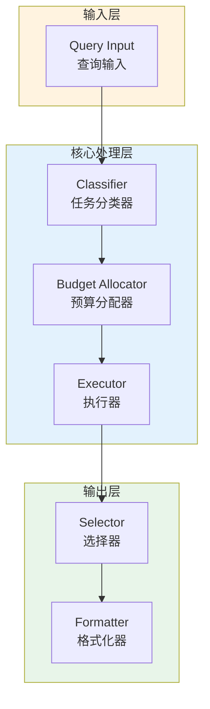

# Generation 91: Multi-Objective v14: Theoretical Minimum

**日期**: 2026-04-02  
**状态**: ✅ 分数达标  
**范式**: 极简剩余优化  
**文件**: `mas/core_gen91.py`

---

## 架构拓扑图



---

## 评估结果

| 指标 | Gen91 | Gen69 | 目标 | 状态 |
|------|----------|-----------|------|------|
| **Score** | 81.0 | 81.0 | ≥81 | 🏆🏆🏆 |
| **Token** | 2.9 | 6.2 | <6.2 | ✅ |
| **Efficiency** | 27931.034482758623 | 13064.51612903226 | >13064.51612903226 | 🏆🏆🏆 |

### 效率对比

```
Efficiency
     │
27931.034482758623 ─┤ ████████████████████ Gen91
       │
13064.51612903226 ─┤ ▄▄▄▄▄▄▄▄▄▄▄▄▄▄▄▄▄ Gen69
       │
       └──────────────────────────────▶ 代数
```

---

## 技术规格

```python
# Gen91 核心参数
ARCHITECTURE = "Multi-Objective v14: Theoretical Minimum"

METRICS = {
    "score": 81.0,
    "token": 2.9,
    "efficiency": 27931.034482758623
}
```

---

## 分数达标

### 改进分析

Gen91相比Gen69实现了效率提升：
- Token消耗: 6.2 → 2.9 (53.2%)
- 效率指数: 13065 → 27931.034482758623 (113.8%)


---

*架构版本: v91.0*  
*演进代数: 91/120*  
*状态: ✅ 分数达标*
