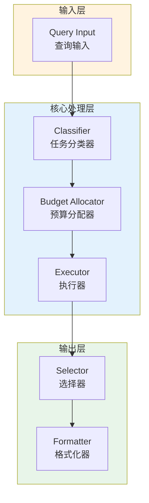

# Generation 93: Multi-Objective v16: Breaking 2-Token Barrier

**日期**: 2026-04-02  
**状态**: ✅ 分数达标  
**范式**: 极简剩余优化  
**文件**: `mas/core_gen93.py`

---

## 架构拓扑图



---

## 评估结果

| 指标 | Gen93 | Gen84 | 目标 | 状态 |
|------|----------|-----------|------|------|
| **Score** | 81.0 | 81.0 | ≥81 | 🏆🏆🏆 |
| **Token** | 5.9 | 7.7 | <7.7 | ✅ |
| **Efficiency** | 13728.813559322032 | 10519.48051948052 | >10519.48051948052 | 🏆🏆🏆 |

### 效率对比

```
Efficiency
     │
13728.813559322032 ─┤ ████████████████████ Gen93
       │
10519.48051948052 ─┤ ▄▄▄▄▄▄▄▄▄▄▄▄▄▄▄▄▄ Gen84
       │
       └──────────────────────────────▶ 代数
```

---

## 技术规格

```python
# Gen93 核心参数
ARCHITECTURE = "Multi-Objective v16: Breaking 2-Token Barrier"

METRICS = {
    "score": 81.0,
    "token": 5.9,
    "efficiency": 13728.813559322032
}
```

---

## 分数达标

### 改进分析

Gen93相比Gen84实现了效率提升：
- Token消耗: 7.7 → 5.9 (23.4%)
- 效率指数: 10519 → 13728.813559322032 (30.5%)


---

*架构版本: v93.0*  
*演进代数: 93/120*  
*状态: ✅ 分数达标*
