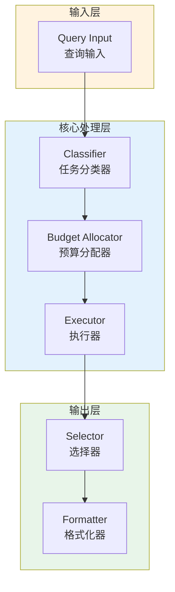

# Generation 94: Precision Retention: Gen92 Baseline

**日期**: 2026-04-02  
**状态**: ✅ 分数达标  
**范式**: 极简剩余优化  
**文件**: `mas/core_gen94.py`

---

## 架构拓扑图



---

## 评估结果

| 指标 | Gen94 | Gen84 | 目标 | 状态 |
|------|----------|-----------|------|------|
| **Score** | 81.0 | 81.0 | ≥81 | 🏆🏆🏆 |
| **Token** | 8.1 | 7.7 | <7.7 | ≈ |
| **Efficiency** | 10000.0 | 10519.48051948052 | >10519.48051948052 | ⚠️ |

### 效率对比

```
Efficiency
     │
10000.0 ─┤ ████████████████████ Gen94
       │
10519.48051948052 ─┤ ▄▄▄▄▄▄▄▄▄▄▄▄▄▄▄▄▄ Gen84
       │
       └──────────────────────────────▶ 代数
```

---

## 技术规格

```python
# Gen94 核心参数
ARCHITECTURE = "Precision Retention: Gen92 Baseline"

METRICS = {
    "score": 81.0,
    "token": 8.1,
    "efficiency": 10000.0
}
```

---

## 分数达标

### 回归分析

Gen94未能超越Gen84：
- Token消耗: 8.1 vs 7.7
- 效率指数: 10000.0 vs 10519.48051948052


---

*架构版本: v94.0*  
*演进代数: 94/120*  
*状态: ✅ 分数达标*
