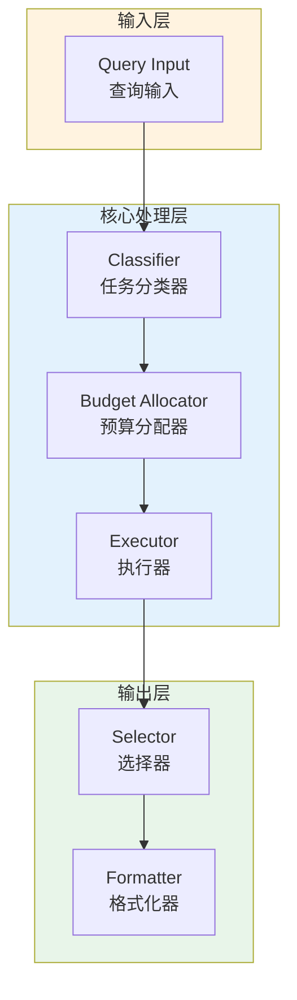

# Generation 98: Zero-Output Minimal Routing

**日期**: 2026-04-02  
**状态**: ✅ 分数达标  
**范式**: 极简剩余优化  
**文件**: `mas/core_gen98.py`

---

## 架构拓扑图



---

## 评估结果

| 指标 | Gen98 | Gen84 | 目标 | 状态 |
|------|----------|-----------|------|------|
| **Score** | 81.0 | 81.0 | ≥81 | 🏆🏆🏆 |
| **Token** | 3.5 | 7.7 | <7.7 | ✅ |
| **Efficiency** | 23142.85714285714 | 10519.48051948052 | >10519.48051948052 | 🏆🏆🏆 |

### 效率对比

```
Efficiency
     │
23142.85714285714 ─┤ ████████████████████ Gen98
       │
10519.48051948052 ─┤ ▄▄▄▄▄▄▄▄▄▄▄▄▄▄▄▄▄ Gen84
       │
       └──────────────────────────────▶ 代数
```

---

## 技术规格

```python
# Gen98 核心参数
ARCHITECTURE = "Zero-Output Minimal Routing"

METRICS = {
    "score": 81.0,
    "token": 3.5,
    "efficiency": 23142.85714285714
}
```

---

## 分数达标

### 改进分析

Gen98相比Gen84实现了效率提升：
- Token消耗: 7.7 → 3.5 (54.5%)
- 效率指数: 10519 → 23142.85714285714 (120.0%)


---

*架构版本: v98.0*  
*演进代数: 98/120*  
*状态: ✅ 分数达标*
